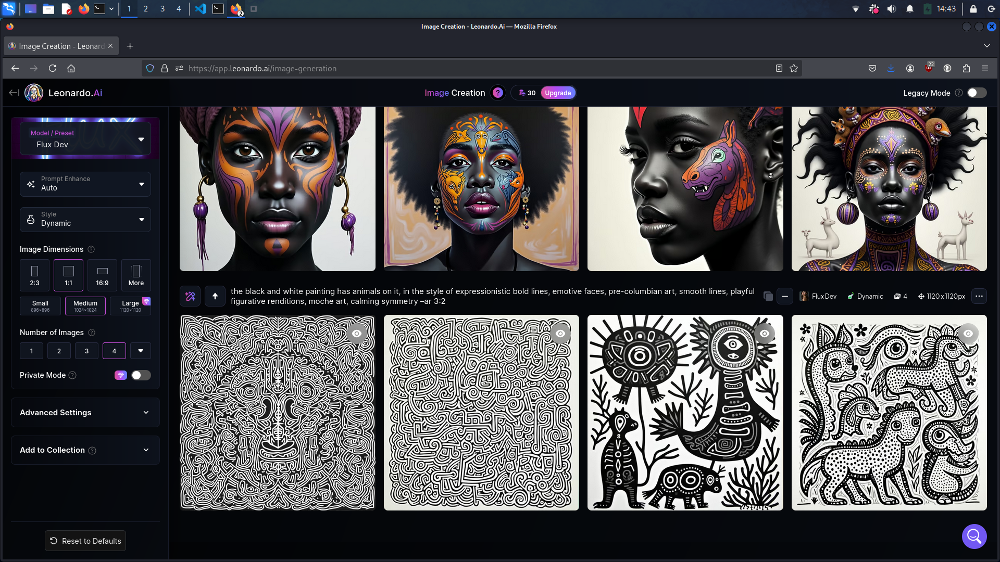
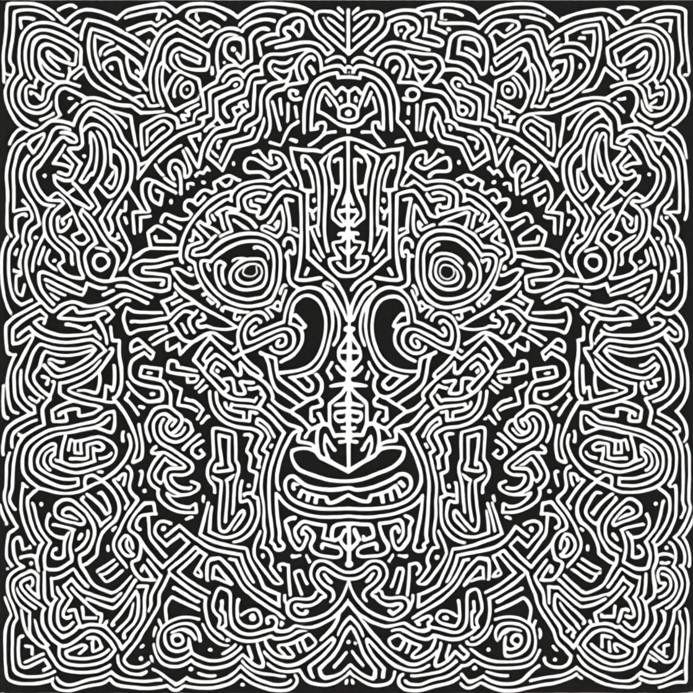
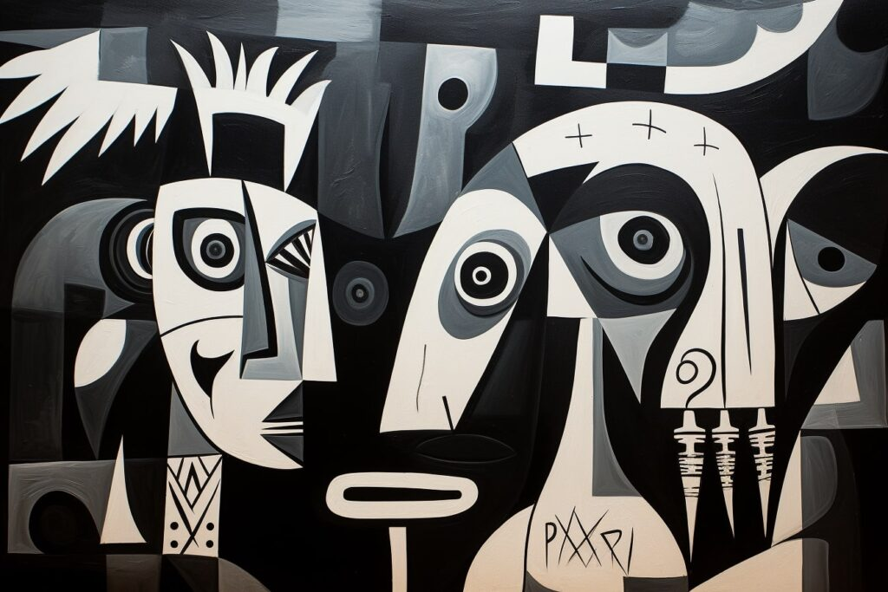

# Pics
## Tool(s)
* Leonardo.AI
## Prompt
```plaintext
    abstract image in black and white painting that has animals on it, in the style of expressionistic bold lines, emotive faces, pre-columbian art, smooth lines, playful figurative renditions, moche art, calming symmetry –ar 3:2
```
## Reply
### 1. screenshot of images generated
<br/>
### 2. image selected
<br/>
### 3. bonus image
<br/>
