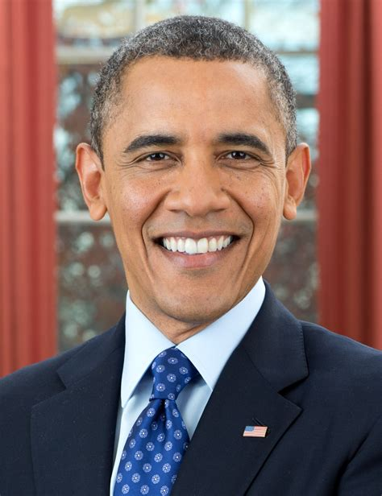
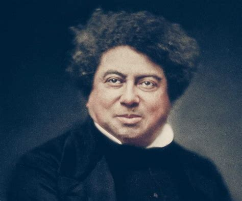
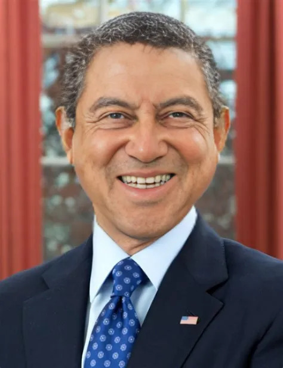
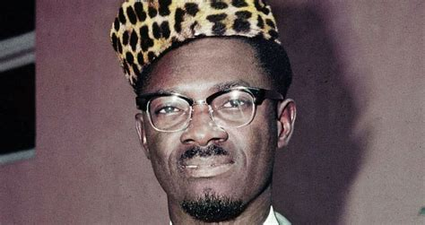
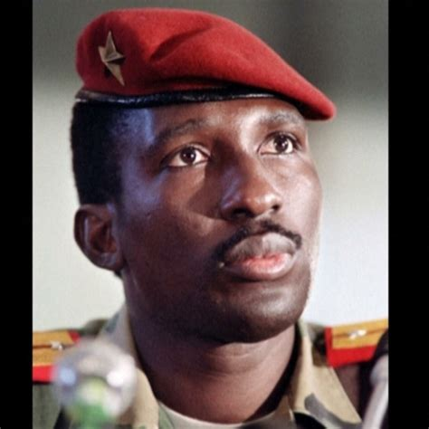
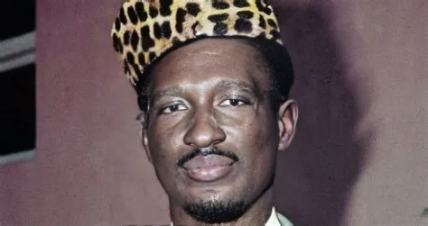
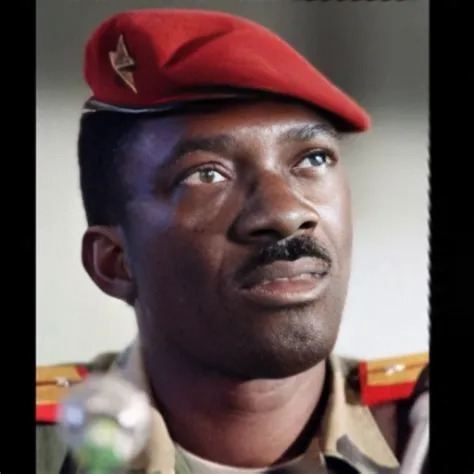
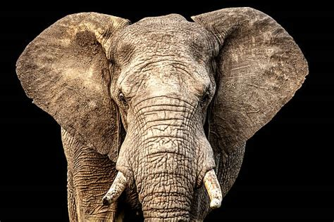
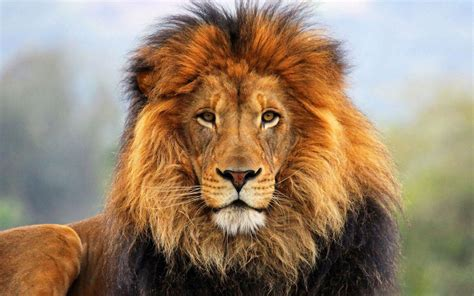

# face swap
* I see  your face ~~drop~~ swap... (get it?)

## Tool(s)
* AIFaceSwap

## results
|original_1|original_2|composite|
|:---:|:---:|:---:|
||||
||||
|||

## observations
* **order of image affects the output** notice how the composite of Lumumba-Sankara differs from Sankara-Lumumba
* **does not work with non-humans** see below (too bad; e-lion-phant would have been 🔥)

|original_1|original_2|composite|
|:---:|:---:|:---:|
||||