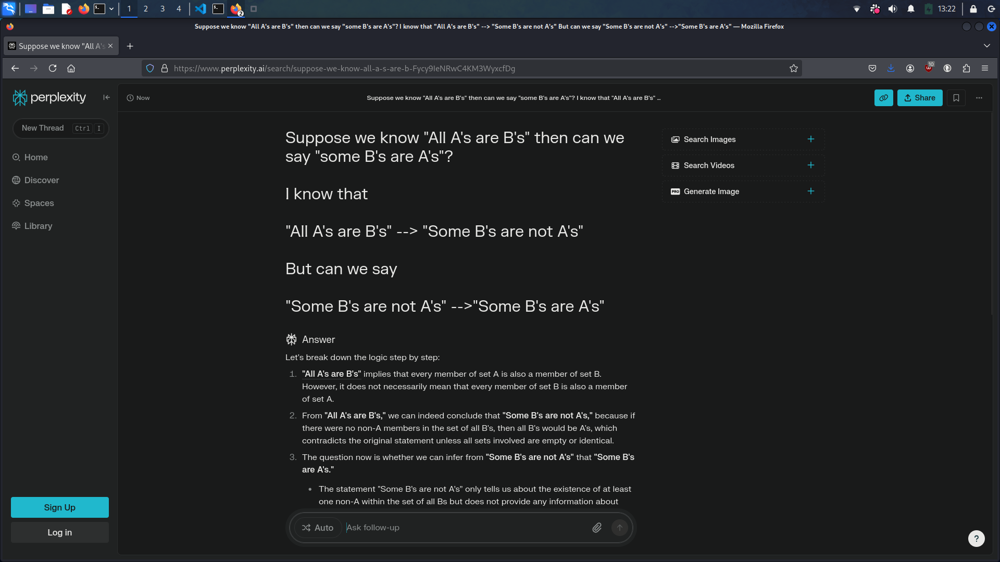
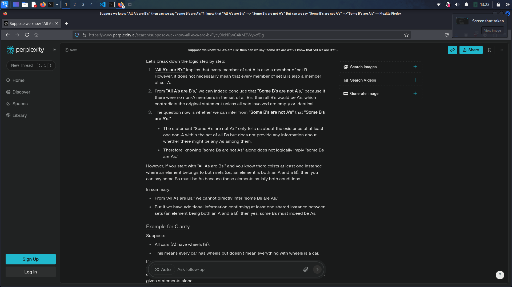
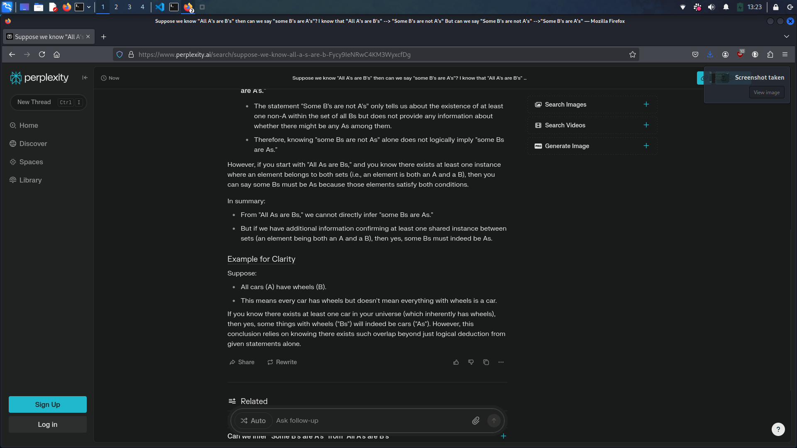

# Logic
## Prompt
```plaintext
Suppose we know "All A's are B's" then can we say "some B's are A's"?

I know that

"All A's are B's" --> "Some B's are not A's"

But can we say

"Some B's are not A's" -->"Some B's are A's"?
```
## Reply
Let's break down the logic step by step:

1. **"All A's are B's"** implies that every member of set A is also a member of set B. However, it does not necessarily mean that every member of set B is also a member of set A.

2. From **"All A's are B's,"** we can indeed conclude that **"Some B's are not A's,"** because if there were no non-A members in the set of all B's, then all B's would be A's, which contradicts the original statement unless all sets involved are empty or identical.

3. The question now is whether we can infer from **"Some B's are not A's"** that **"Some B's are A's."**

   - The statement "Some B’s are not A’s” only tells us about the existence of at least one non-A within the set of all Bs but does not provide any information about whether there might be any As among them.
   
   - Therefore, knowing "some Bs are not As” alone does not logically imply "some Bs are As."

However, if you start with "All As are Bs," and you know there exists at least one instance where an element belongs to both sets (i.e., an element is both an A and a B), then you can say some Bs must be As because those elements satisfy both conditions.

In summary:
- From "All As are Bs," we cannot directly infer "some Bs are As."
- But if we have additional information confirming at least one shared instance between sets (an element being both an A and a B), then yes, some Bs must indeed be As.

#### Example for Clarity

Suppose:
- All cars (A) have wheels (B).
- This means every car has wheels but doesn't mean everything with wheels is a car.
  
If you know there exists at least one car in your universe (which inherently has wheels), then yes, some things with wheels ("Bs") will indeed be cars ("As"). However, this conclusion relies on knowing there exists such overlap beyond just logical deduction from given statements alone.
## Screenshots
 <br/>
 <br/>
 <br/>
 <br/>
